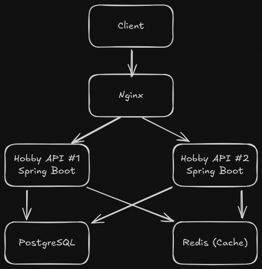

# Hobby API

A **Spring Boot** application with **GraphQL**, **PostgreSQL**, **Redis**, and **Nginx load balancing**.
The system is designed to store and retrieve hobbies data with caching support.
Nginx is used as a **load balancer** with a **Round Robin** strategy to distribute traffic between two API instances.

---

## 🚀 How to Run

1. **Build and start with Docker Compose**:

   ```bash
   docker-compose up --build
   ```

2. **Default Access Points**:

   * API (via Nginx Load Balancer): `http://localhost`
   * Direct API instance #1: `http://localhost:8081`
   * Direct API instance #2: `http://localhost:8082`
   * PostgreSQL: `localhost:5432`
   * Redis: `localhost:6379`

---

## 📦 Tech Stack

* **Java 17**
* **Spring Boot** (Web, GraphQL, Data JPA, Redis)
* **PostgreSQL** – main database
* **Redis** – caching
* **Nginx** – load balancer (Round Robin)
* **Docker & Docker Compose**

---

## ⚙️ Environment Variables

| Variable                     | Description             | Example                                      |
| ---------------------------- | ----------------------- | -------------------------------------------- |
| `SPRING_DATASOURCE_URL`      | Database connection URL | `jdbc:postgresql://postgres:5432/hobbies_db` |
| `SPRING_DATASOURCE_USERNAME` | Database username       | `postgres`                                   |
| `SPRING_DATASOURCE_PASSWORD` | Database password       | `mypassword`                                 |
| `SPRING_REDIS_HOST`          | Redis host              | `redis`                                      |
| `SPRING_REDIS_PORT`          | Redis port              | `6379`                                       |

---

## 🧩 Example GraphQL Query

**Request:**

```graphql
query {
  hobbies {
    id
    name
    iconLink
    categories {
        id
        name
        hobbies {
            name
        }
    }
  }
}
```

**Response:**

```json
{
  "data": {
    "hobbies": [
      {
        "id": "1",
        "name": "Air sports",
        "iconLink": "https://cdn-icons-png.flaticon.com/128/1384/1384739.png",
        "categories": [
          {
            "id": "2",
            "name": "Outdoors and sports",
            "hobbies": [
              {
                "name": "Air sports"
              },
              {
                "name": "Airsoft"
              },
              {
                "name": "Amateur geology"
              },
            ],
          }
        ]
      }
    ]
  }
}
```

---

## 🏗 Architecture



## 📜 License

MIT
